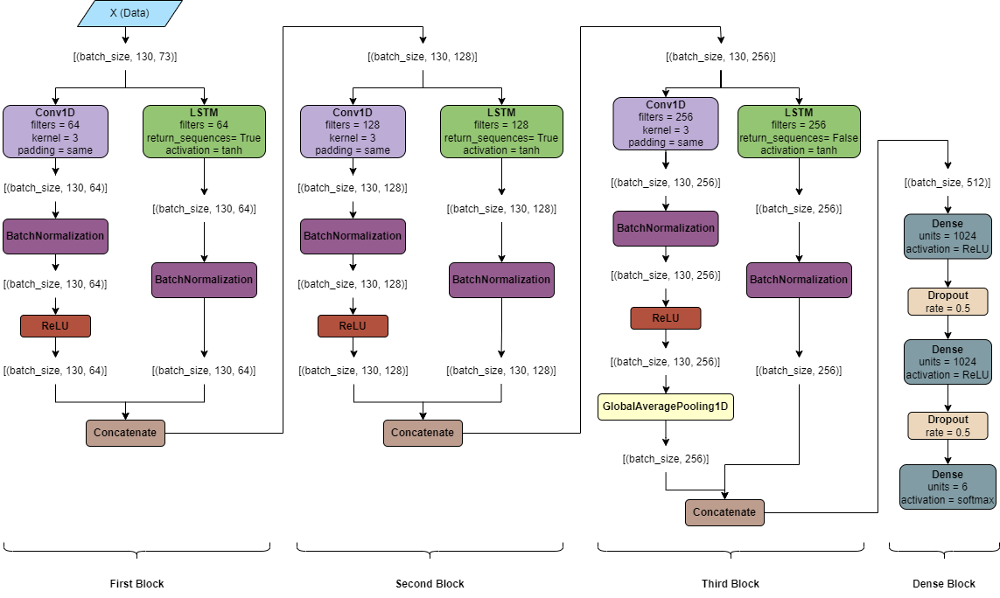

# speech-emotion-recognition

## Overview
This repository contains code and models for Speech Emotion Recognition (SER) using acoustic features. The implemented model in this project outperforms popular deep learning architectures such as VGG-16, LeNet-5, AlexNet, and Bidirectional LSTM in terms of accuracy and efficiency.

## Research Paper
[Paper](./sentiment-analysis.pdf)

## Introduction
Speech Emotion Recognition (SER) is the task of identifying the emotional state of a speaker based on their speech. This project focuses on utilizing acoustic features for SER and presents a model that surpasses the performance of well-known architectures.

## Features
- Acoustic feature extraction using librosa.
- Custom deep learning model for SER.
- Evaluation and comparison with VGG-16, LeNet-5, AlexNet, and Bidirectional LSTM.

## Model Architecture

## Dataset
We have collected audio recordings from four reputable and varied sources for this compilation of
sentiment analysis datasets:
- CREMA-D
- RAVDESS
- TESS
- SAVEE

## Feature extraction
we are extracting our data using a variety of audio features:
- MFCCs
- Chroma Feature
- Spectral Centroid
- Spectral Contrast
- Zero Crossing Rate (ZCR)
- Root Mean Square Energy (RMSE)
- Mean, Standard Deviation, Kurtosis, Skewness
